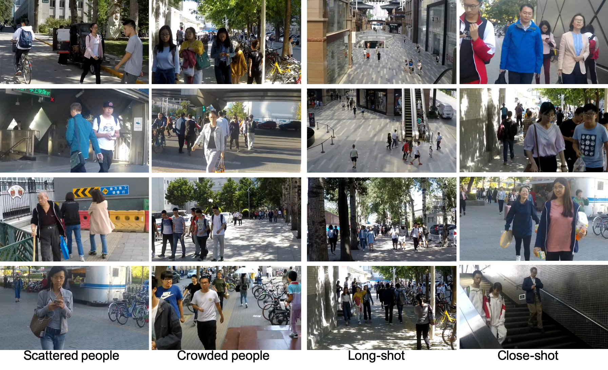

# Human-Aware Motion Deblurring
=======================================================================================

[Ziyi Shen](https://sites.google.com/site/ziyishenmi/), [Wenguan Wang](https://sites.google.com/view/wenguanwang/), [Xiankai Lu](https://sites.google.com/site/xiankailu111/), [Jianbin Shen](http://iitlab.bit.edu.cn/mcislab/~shenjianbing/), [Haibin Ling](https://www3.cs.stonybrook.edu/~hling/), Tingfa Xu and [Ling Shao](https://scholar.google.com/citations?user=z84rLjoAAAAJ&hl=en)


International Conference on Computer Vision (ICCV), 2019

=======================================================================================

## :fire::fire::fire:HIDE Dataset
In this work, we propose a new blurry image dataset (HIDE) with respect to the dynamic deblurring problem. The multiple blurs caused by the relative movement between an imaging device and a scene, mainly include camera shaking and object movement. To fully capture the dynamic blurs caused by the passive device interference and initiative actions, our HIDE dataset is eleborately collected to cover both wide-range and close-range scenes and address human-aware motion deblurring. 

We release the HIDE dataset with the blurry and sharp image pair, it could be downloaded from HIDE_dataset.

|HIDE | Training | Testing
|----|----|----
|　| Scattered Crowded|Long-sho Close-shot
|Images|6397|1063     962


The foreground human bounding box annotations as well be provided for this human-aware delurrring task (Coming Soon).:blush:




### Citation 
```
@inproceedings{HAdeblur,
   author={Shen, Ziyi and Wang, Wenguan and Shen, Jianbing and Ling, Haibin and Xu, Tingfa and Shao, Ling}, 
   title={Motion Deblurring via Human-Aware Attention Network}, 
   booktitle={IEEE International Conference on Computer Vision},
   year={2019}
}
```
